[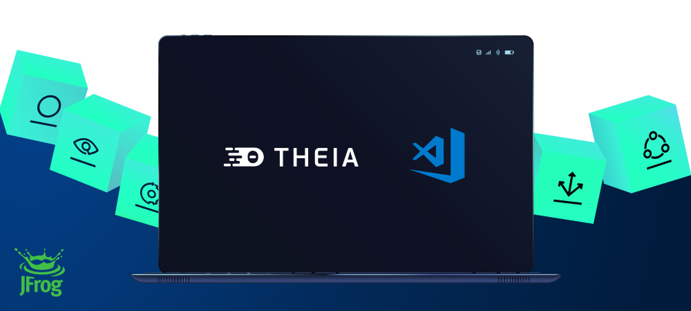](#readme)

<div align="center">

# JFrog Extension for VS Code & Eclipse Theia


 [](https://marketplace.visualstudio.com/items?itemName=JFrog.jfrog-vscode-extension)

[](https://marketplace.visualstudio.com/items?itemName=JFrog.jfrog-vscode-extension)  [](https://open-vsx.org/extension/JFrog/jfrog-vscode-extension)
[](https://github.com/jfrog/frogbot#readme) [](https://github.com/jfrog/jfrog-vscode-extension/actions/workflows/test.yml?branch=master)

</div>

# Table of Contents
- [About this Extension](#about-this-extension)
- [Getting Started](#getting-started)
    - [Install the **JFrog** extension in VS Code](#install-the-jfrog-extension-in-vs-code)
    - [Connecting VS Code to Your JFrog Platform](#connecting-vs-code-to-your-jfrog-platform)
    - [Using the extension](#using-the-extension)
        - [Severity Icons](#severity-icons)
- [The Local View](#the-local-view)
    - [General](#general)
    - [Software Composition Analysis (SCA)](#software-composition-analysis)
    - [CVE Research and Enrichment](#cve-research-and-enrichment)
    - [Vulnerability Contextual Analysis](#vulnerability-contextual-analysis)
    - [Secrets Detection](#secrets-detection)
- [The CI View](#the-ci-view)
    - [How Does It Work?](#how-does-it-work)
    - [Setting Up Your CI Pipeline](#setting-up-your-ci-pipeline)
    - [Setting Up the CI View](#setting-up-the-ci-view)
- [Extension Settings](#extension-settings)
    - [Apply Xray Policies to your Projects](#apply-xray-policies-to-your-projects)
    - [Exclude Paths from Scan](#exclude-paths-from-scan)
    - [Proxy Configuration](#proxy-configuration)
    - [Proxy Authorization](#proxy-authorization)
        - [Basic authorization](#basic-authorization)
        - [Access token authorization](#access-token-authorization)
        - [Example](#example)
- [Behind the Scenes - Software Composition Analysis (SCA)](#behind-the-scenes)
- [Troubleshooting](#troubleshooting)
- [License](#license)
- [Building and Testing the Sources](#building-and-testing-the-sources)
    - [Preconditions](#preconditions)
- [Code Contributions](#code-contributions)
    - [Guidelines](#guidelines)

## About this Extension
The cost of remediating a vulnerability is akin to the cost of fixing a bug.
The earlier you remediate a vulnerability in the release cycle, the lower the cost.
The extension allows developers to find and fix security vulnerabilities in their projects and to see valuable information
about the status of their code by continuously scanning it locally with the [JFrog Platform](https://jfrog.com/xray/).

### What security capabilities do we provide?
#### 🌟 Basic
<details>
  <summary>Software Composition Analysis (SCA)</summary>
Scans your project dependencies for security issues and shows you which dependencies are vulnerable. If the vulnerabilities have a fix, you can upgrade to the version with the fix in a click of a button.
</details>

<details>
  <summary>CVE Research and Enrichment</summary>
For selected security issues, get leverage-enhanced CVE data that is provided by our JFrog Security Research team.
Prioritize the CVEs based on:

- **JFrog Severity**: The severity given by the JFrog Security Research team after the manual analysis of the CVE by the team.
CVEs with the highest JFrog security severity are the most likely to be used by real-world attackers.
This means that you should put effort into fixing them as soon as possible.
- **Research Summary**: The summary that is based on JFrog's security analysis of the security issue provides detailed technical information on the specific conditions for the CVE to be applicable.
- **Remediation**: Detailed fix and mitigation options for the CVEs

You can learn more about enriched CVEs [here](https://jfrog.com/help/r/jfrog-security-documentation/jfrog-security-cve-research-and-enrichment).

Check out what our research team is up to and stay updated on newly discovered issues by clicking on this link: <https://research.jfrog.com>
</details>

#### 🌟 Advanced
*Requires Xray version 3.66.5 or above and Enterprise X / Enterprise+ subscription with [Advanced DevSecOps](https://jfrog.com/xray/#xray-advanced).*

<details>
  <summary>Vulnerability Contextual Analysis</summary>
Uses the code context to eliminate false positive reports on vulnerable dependencies that are not applicable to the code.
Vulnerability Contextual Analysis is currently supported for Python, Java and JavaScript code.
</details>

<details>
  <summary>Static Application Security Testing (SAST)</summary>
Provides fast and accurate security-focused engines that detect zero-day security vulnerabilities on your source code sensitive operations, while minimizing false positives.
</details>

<details>
  <summary>Secrets Detection</summary>
Prevents the exposure of keys or credentials that are stored in your source code.
</details>

<details>
  <summary>Infrastructure as Code (IaC) Scan</summary>
Secures your IaC files. Critical to keeping your cloud deployment safe and secure.
</details>

#### 🌟 Additional Perks

- Security issues are easily visible inline.
- The results show issues with context, impact, and remediation.
- View all security issues in one place, in the JFrog tab.
- For Security issues with an available fixed version, you can upgrade to the fixed version within the plugin.
- Track the status of the code while it is being built, tested, and scanned on the CI server.

The extension also applies [JFrog File Spec JSON schema](https://raw.githubusercontent.com/jfrog/jfrog-cli/master/schema/filespec-schema.json) on the following file patterns: `**/filespecs/*.json`, `*filespec*.json` and `*.filespec`. Read more about JFrog File specs [here](https://www.jfrog.com/confluence/display/JFROG/FileSpec).

#### 🛡️ Supported Packages
| Features                                             | [Go](#go-projects) | [Maven](#maven-projects) | [npm](#npm-projects) | [Yarn v1](#yarn-v1-projects) | [Pypi](#pypi-projects) | [.NET](#net-projects) | [Terraform](#-infrastructure-as-code-(iac)-Scan) |
|---------------------------------------------------|:----:|:------:|:-------:|:----:|:--------:|:-------:|:-------:|
| [SCA](#-software-composition-analysis-sca)                                               |  ✅  |   ✅   |   ✅    |  ✅  |    ✅    |   ✅    |   ❌    |
| [Upgrade vulnerable dependencies to fixed versions](#updating-dependencies) |  ✅  |   ✅   |   ✅    |  ✅  |    ✅    |   ✅    |   ❌    |
| [Vulnerability Contextual Analysis](#-vulnerability-contextual-analysis)                               |  ❌  |    ✅   |   ✅    |  ✅  |    ✅    |   ❌    |   ❌    |
| [Static Application Security Testing (SAST)](#-static-application-security-testing-(SAST))                               |  ❌  |    ✅   |   ✅    |  ✅  |    ✅    |   ❌    |   ❌    |
| [Secrets Detection](#-secrets-detection)                          |  ✅  |   ✅   |   ✅    |  ✅  |    ✅    |   ✅    |✅    |
| [Exclude dev dependencies](#exclude-development-dependencies-during-scan)                          |  ❌  |   ❌   |   ✅    |  ❌  |    ❌    |   ❌    |   ❌    |
| [Infrastructure as Code (IaC) Scan](#-infrastructure-as-code-(iac)-Scan)                          |  ❌  |   ❌   |   ❌    |  ❌  |    ❌    |   ❌    |   ✅     |

## Getting Started

1. [Install the **JFrog** extension in VS Code](#install-the-jfrog-extension-in-vs-code)
2. [Connect VS Code to Your JFrog Environment](#connecting-vs-code-to-your-jfrog-environment)
3. [Start using the extension](#using-the-extension)


## Install the **JFrog** extension in VS Code

The extension is available to install from the VS Code extensions marketplace. after installing the JFrog extension tab 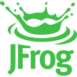 will appear in the activity bar
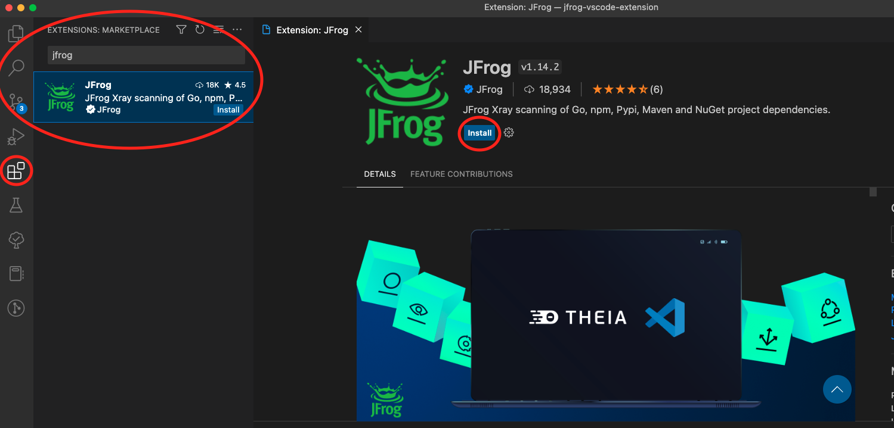

## Connecting VS Code to Your JFrog Platform

<details>
<summary>If you don't have a JFrog Platform instance, create a free instance in the cloud by running one of the following commands in your terminal.</summary>

**MacOS and Linux using cUrl**

```
curl -fL "https://getcli.jfrog.io?setup" | sh
```

**Windows using PowerShell**

```
powershell "Start-Process -Wait -Verb RunAs powershell '-NoProfile iwr https://releases.jfrog.io/artifactory/jfrog-cli/v2-jf/[RELEASE]/jfrog-cli-windows-amd64/jf.exe -OutFile $env:SYSTEMROOT\system32\jf.exe'" ; jf setup
```
The commands will do the following:

1. Install JFrog CLI on your machine.
2. Create a FREE JFrog environment in the cloud for you.
3. Configure VS Code to connect to your new environment.
</details>
<br>

Once the JFrog Extension is installed in VS Code, click on the JFrog tab:

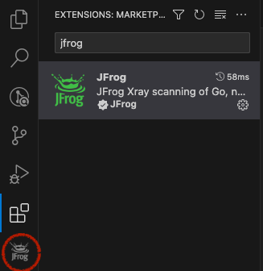


This will open the Sign in page:

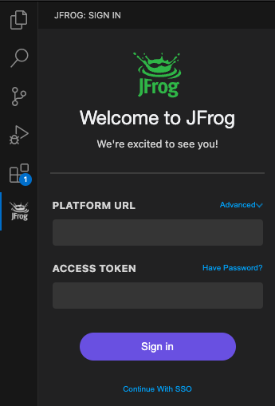

Fill in your connection details and click on the `Sign In` button to start using the extension

**Note**: If you would like to use custom URLs for Artifactory or Xray, click on 'Advanced'.

You can also choose other option to authenticate with your JFrog Platform instance:
1. [SSO](#connect-using-sso)
2. [JFrog CLI's Connection Details](#connect-using-jfrog-cli-connection-details)
3. [Using Environment Variables](#connect-using-environment-variables).


### Connect Using SSO

To sign in using SSO, follow these steps:

1. On the sign-in page, click the `Continue with SSO` button:


2. After entering your JFrog platform URL, click on `Sign in With SSO`.

3. It will take a few seconds for the browser to redirect you to the SSO sign in page.

4. You should now be signed in in at vscode.

### Connect Using JFrog CLI Connection Details

If JFrog CLI is installed on your machine and is configured with your JFrog Platform connection details, then you should see the message popup in the Sigh in page:

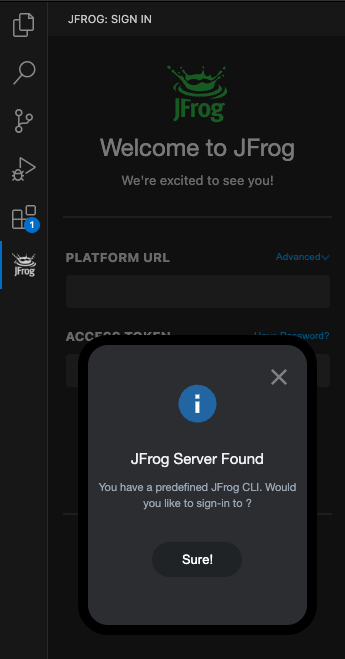


### Connect Using Environment Variables

You may set the connection details using the following environment variables. VS Code will read them after it is launched.

-   `JFROG_IDE_URL` - JFrog URL
-   `JFROG_IDE_USERNAME` - JFrog username
-   `JFROG_IDE_PASSWORD` - JFrog password
-   `JFROG_IDE_ACCESS_TOKEN` - JFrog access token
-   `JFROG_IDE_STORE_CONNECTION` - Set the value of this environment variable to **true**, if you'd like VS Code to store the connection details after reading them from the environment variables.

Once the above environment variables are configured, you can expect to see a message popup in the Sigh in page:

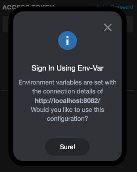

**Note**: For security reasons, it is recommended to unset the environment variables after launching VS Code.

## Using the Extension

The extension offers two modes, **Local** and **CI**.
The two modes can be toggled by pressing on their respective buttons that will appear next to the components tree.

-   The **Local** view displays information about the local code as it is being developed in VS Code. The developer can scan their local workspace continuously. The information is displayed in the **Local** view.
-   The **CI** view allows the tracking of the code as it is built, tested and scanned by the CI server. It displays information about the status of the build and includes a link to the build log on the CI server.

### Severity Icons
The icon demonstrates the top severity issue of a selected component and its transitive dependencies. The following table describes the severities from highest to lowest:

| Icon                                                          | Severity  | Description                      |
|:---------------------------------------------------------------:|:---------:|:--------------------------------:|
|   |  Critical |   Issue with critical severity   |
|   |  High  |   Issue with high severity   |
|   |  Medium  |   Issue with medium severity   |
|   |  Low  |   Issue with low severity   |
|   |  Unknown  |   Issue with unknown severity   |
|  |  Not Applicable  |   CVE issue that is not applicable to your source code   |
|   |  Normal  |   No issues (Used only in CI view)   |

## The Local View
### General
The JFrog VS Code Extension enables continuous scans of your project with the JFrog Platform. The security related information will be displayed under the Local view.
It allows developers to view vulnerability information about their dependencies and source code in their IDE.
With this information, you can make an informed decision on whether to use a component or not before it gets entrenched into the organization’s product.

scan your workspace by clicking the Scan/Rescan button, the  icon at the extension tab or click on Start Xray Scan from within the editor. The scan will create a list of files with vulnerabilities in the workspace.
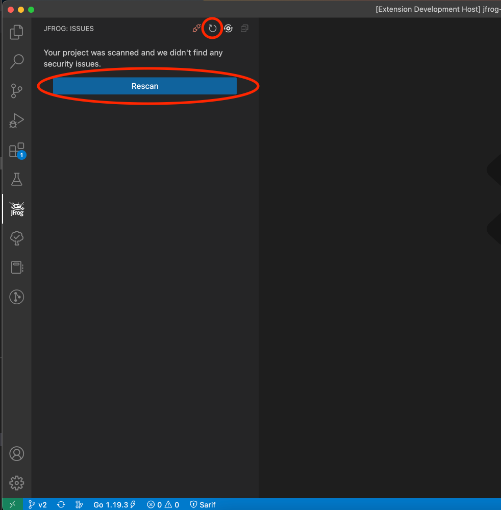

<div id="software-composition-analysis">

### Software Composition Analysis (SCA)
Each descriptor file (like pom.xml in Maven, go.mod in Go, etc.) displayed in the JFrog Panel contains vulnerable dependencies, and each dependency contains the vulnerabilities themselves.

Each file node in the tree is interactive. Click and expand it to view its children noded and navigate to the corresponding file in the IDE editor for better visibility. Upon navigating to a file, the extension will highlight the vulnerable line, making it easier to locate the specific issue

In addition the locations with vulnerabilities will be marked in the editor. By clicking on the light bulb icon next to a vulnerable location in the editor, you can instantly jump to the corresponding entry in the tree view.

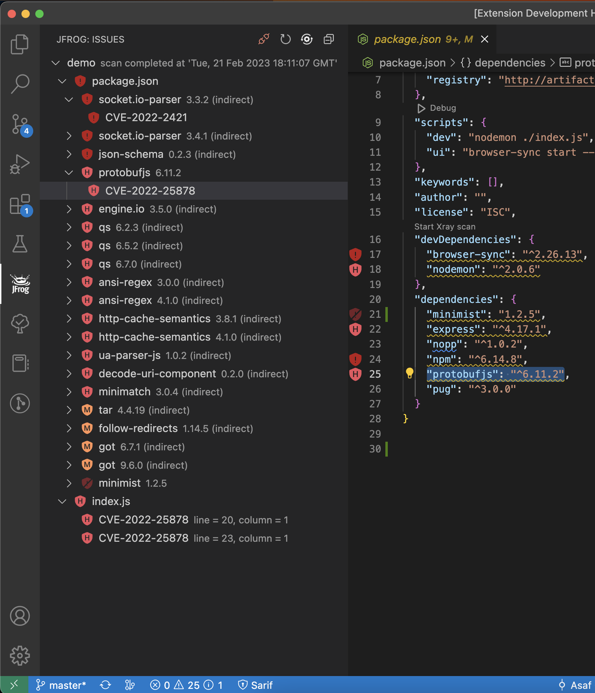

Clicking on a CVE in the list will open the location with the issue in the editor and a vulnerability details view. This view contains information about the vulnerability, the vulnerable component, fixed versions, impact paths and much more.

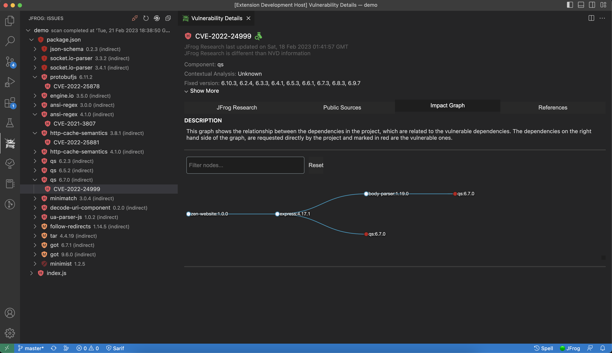
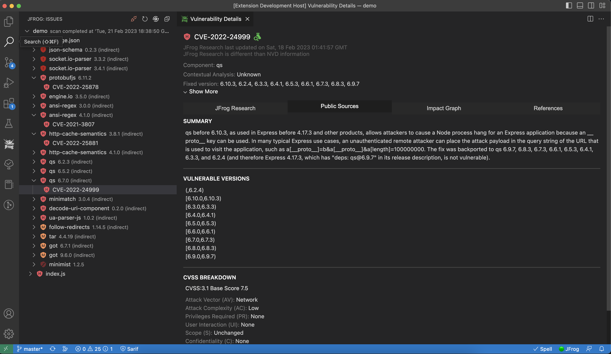

Update a vulnerable direct dependency to a fixed version directly from the vulnerable location at the editor using quick fix
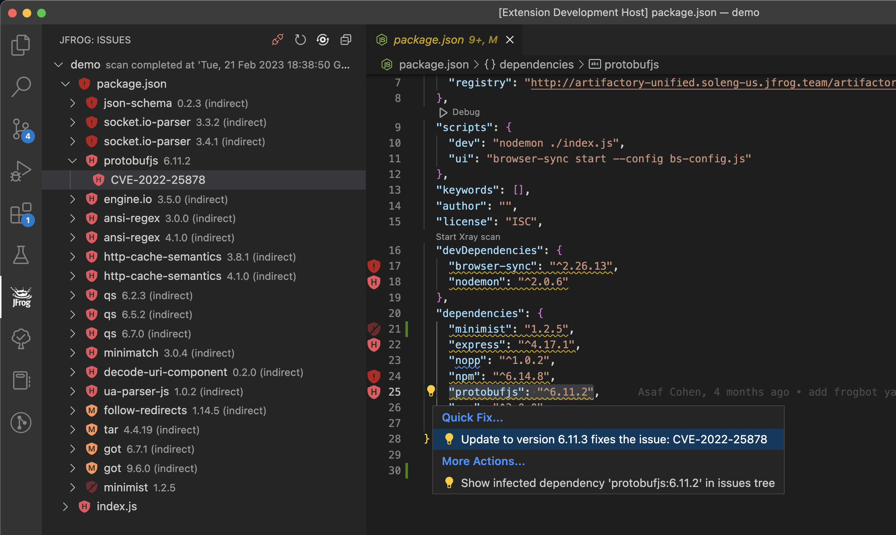

When Xray watches are enabled and a vulnerability is detected, a closed eye icon will appear next to the vulnerability line in the JFrog extension. By clicking on this icon, you can initiate the process of creating an [Ignore Rule](https://www.jfrog.com/confluence/display/JFROG/Ignore+Rules) in Xray.


### CVE Research and Enrichment
For selected security issues, get leverage-enhanced CVE data that is provided by our JFrog Security Research team. Prioritize the CVEs based on:

* JFrog Severity: The severity given by the JFrog Security Research team after the manual analysis of the CVE by the team. CVEs with the highest JFrog security severity are the most likely to be used by real-world attackers. This means that you should put effort into fixing them as soon as possible.
* Research Summary: The summary that is based on JFrog's security analysis of the security issue provides detailed technical information on the specific conditions for the CVE to be applicable.
Remediation: Detailed fix and mitigation options for the CVEs

Check out what our research team is up to and stay updated on newly discovered issues by clicking on this [link](https://research.jfrog.com).

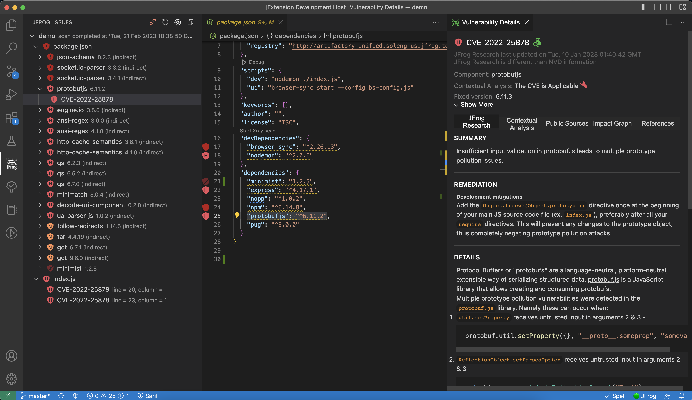

### Vulnerability Contextual Analysis
> **_NOTE:_**  Vulnerability Contextual Analysis requires Xray version 3.66.5 or above and Enterprise X / Enterprise+ subscription with Advanced DevSecOps.

Xray automatically validates some high and very high impact vulnerabilities, such as vulnerabilities that have prerequisites for exploitations, and provides contextual analysis information for these vulnerabilities, to assist you in figuring out which vulnerabilities need to be fixed. Vulnerability Contextual Analysis data includes:

* Vulnerability Contextual Analysis status: Vulnerability Contextual Analysis results indicating if a CVE was found applicable in your application or not applicable.
* Vulnerability Contextual Analysis breakdown: An explanation provided by our research team as to why the CVE was found applicable or not applicable.
* Remediation: Contextual mitigation steps and options provided by our research team that assist you with remediating the issues.

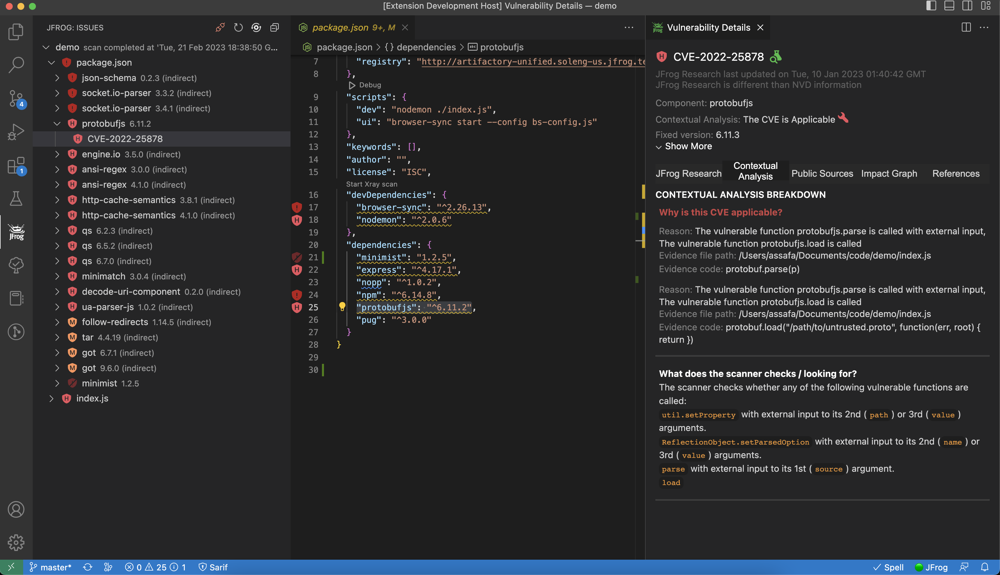

### Static Application Security Testing (SAST)
> **_NOTE:_**  Static Application Security Testing (SAST) requires Xray version 3.66.5 or above and Enterprise X / Enterprise+ subscription with Advanced DevSecOps.

JFrog SAST scans mainly for specific sensitive operations (DB queries, OS commands, outgoing connection destinations, etc) that can be controlled by an external attacker without proper sanitation injections such as: SQL injections, Command injections, Code injections and SSRF.
It also detects cases when certain APIs (encryption, cryptographic signing, file operations, etc.) are used with parameters or under circumstances that render the API use unsafe.

SAST findings are presented in a way that will help you easily locate the vulnerable data flow in your code. The data is represented within an easy-to-use interface that enables you to track each vulnerability in the code and provides the following information per vulnerability:

* **Data Flow Analysis**: Provides information on the overall code flow and the different entry points of the vulnerability up to the execution point of the vulnerability. At JFrog we understand the developers need to see the entire picture of their code, rather than just providing the specific vulnerability found in the code. With Data Analysis Flow you will be able to follow the entire lifecycle of the vulnerability.
* **Fix Steps**: To help you fix the security issues, the JFrog security team provides you with detailed fixes and mitigation options for the vulnerabilities. Xray empowers you to make smart choices when creating the mitigation plan and choosing the paths with the highest return on investment.
Along with the JFrog severity given, you can make informed decisions on what vulnerabilities are a priority to fix. For example, vulnerabilities with low JFrog security severity are considered less risky, as it would be very unlikely to exploit them in the real world, or the impact of the exploitation is low.

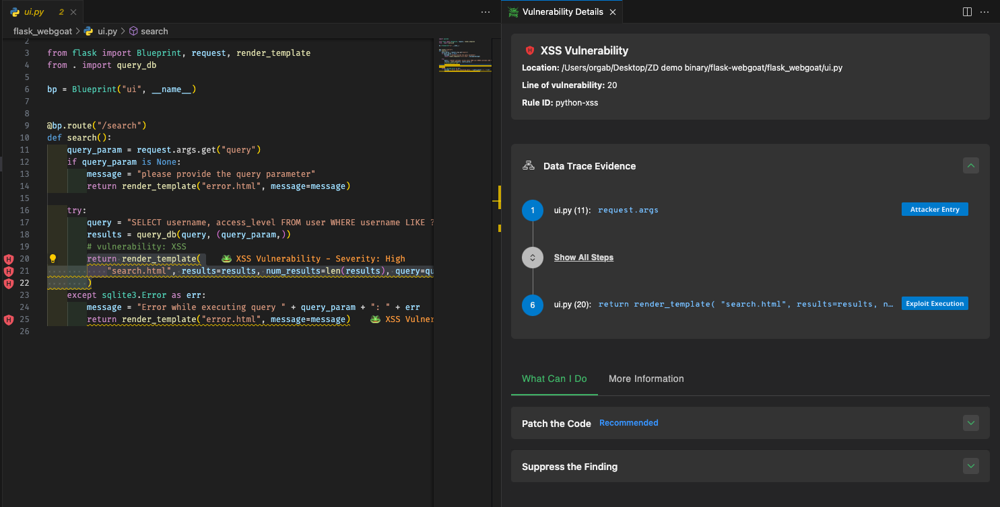

### Secrets Detection
> **_NOTE:_**  Secrets Detection requires Xray version 3.66.5 or above and Enterprise X / Enterprise+ subscription with Advanced DevSecOps.

Detect any secrets left exposed inside the code. to prevent any accidental leak of internal tokens or credentials. To ignore detected secrets, you can add a comment which includes the phrase *jfrog-ignore* above the line with the secret.

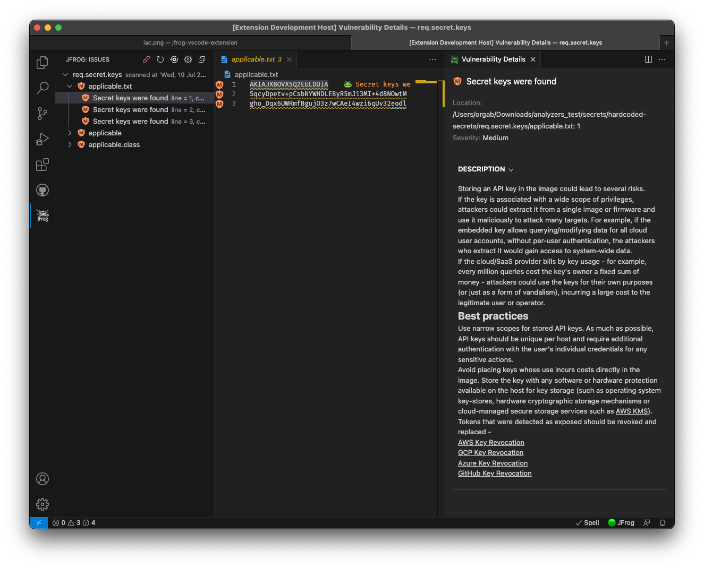

### Infrastructure as Code (IaC) Scan
> **_NOTE:_**  Infrastructure as Code (IaC) requires Xray version 3.66.5 or above and Enterprise X / Enterprise+ subscription with Advanced DevSecOps.

Scan Infrastructure as Code (Terraform) files for early detection of cloud and infrastructure misconfigurations.

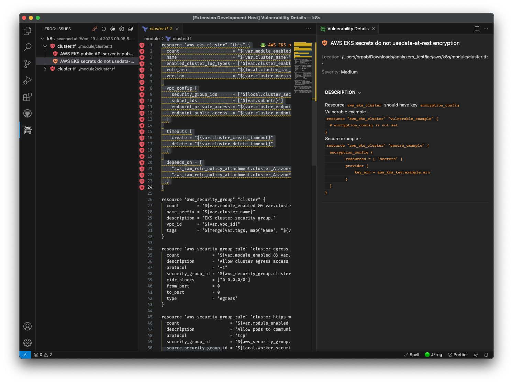

## The CI View
The CI view of the extension allows you to view information about your builds directly from your CI system. This allows developers to keep track of the status of their code, while it is being built, tested and scanned as part of the CI pipeline, regardless of the CI provider used.

This information can be viewed inside JFrog VS Code Extension, from the JFrog Panel, after switching to CI mode.

The following details can be made available in the CI view.

-   Status of the build run (passed or failed)
-   Build run start time
-   Git branch and latest commit message
-   Link to the CI run log
-   Security information about the build artifacts and dependencies

### How Does It Work?

The CI information displayed in VS Code is pulled by the JFrog Extension directly from JFrog Artifactory. This information is stored in Artifactory as part of the build-info, which is published to Artifactory by the CI server.

Read more about build-info in the [Build Integration](https://www.jfrog.com/confluence/display/JFROG/Build+Integration) documentation page. If the CI pipeline is also configured to scan the build-info by JFrog Xray, the JFrog VS Code Extension will pull the results of the scan from JFrog Xray and display them in the CI view as well.

### Setting Up Your CI Pipeline

Before VS Code can display information from your CI in the CI View, your CI pipeline needs to be configured to expose this data.
Read [this guide](https://www.jfrog.com/confluence/display/JFROG/Setting+Up+CI+Integration) which describes how to configure your CI pipeline.

### Setting Up the CI View

Set your CI build name in the Build name pattern field at the [Extension Settings](#extension-settings). This is the name of the build published to Artifactory by your CI pipeline. You have the option of setting \* to view all the builds published to Artifactory.

After your builds were fetched from Artifactory, press on the Builds  button to choose what build to display.

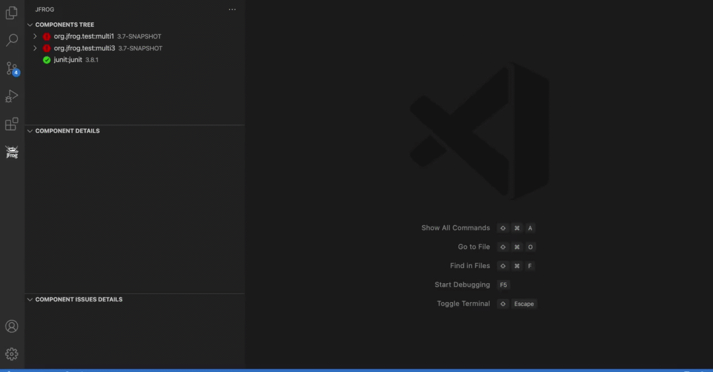

## Extension Settings

To open the extension settings, use the extension settings icon:
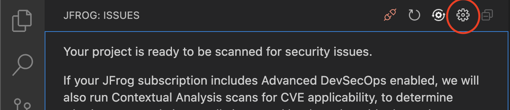
Or use the following VS Code menu command:

-   On Windows/Linux - File > Preferences > Settings > Extensions > JFrog
-   On macOS - Code > Preferences > Settings > Extensions > JFrog

### Apply Xray Policies to your Projects

You can configure the JFrog VS-Code extension  to use the security policies you create in Xray. Policies enable you to create a set of rules, in which each rule defines security criteria, with a corresponding set of automatic actions according to your needs. Policies are enforced when applying them to Watches.

If you'd like to use a JFrog Project that is associated with the policy, follow these steps:

1. Create a [JFrog Project](https://www.jfrog.com/confluence/display/JFROG/Projects), or obtain the relevant JFrog Project key.
1. Create a [Policy](https://www.jfrog.com/confluence/display/JFROG/Creating+Xray+Policies+and+Rules) on JFrog Xray.
1. Create a [Watch](https://www.jfrog.com/confluence/display/JFROG/Configuring+Xray+Watches) on JFrog Xray and assign your Policy and Project as resources to it.
1. Configure your Project key in the [Extension Settings](#extension-settings).

If however your policies are referenced through an Xray Watch or Watches, follow these steps instead:

1. Create one or more [Watches](https://www.jfrog.com/confluence/display/JFROG/Configuring+Xray+Watches) on JFrog Xray.
1. Configure your Watches in the [Extension Settings](#extension-settings).

### Exclude Paths from Scan

By default, paths containing the words `test`, `venv` and `node_modules` are excluded from Xray scan.
The exclude pattern can be configured in the [Extension Settings](#extension-settings).

### Proxy Configuration

If your JFrog environment is behind an HTTP/S proxy, follow these steps to configure the proxy server:

1. Go to Preferences --> Settings --> Application --> Proxy
1. Set the proxy URL under 'Proxy'.
1. Make sure 'Proxy Support' is 'override' or 'on'.

-   Alternatively, you can use the HTTP_PROXY and HTTPS_PROXY environment variables.

### Proxy Authorization

If your proxy server requires credentials, follow these steps:

1. Follow 1-3 steps under [Proxy configuration](#proxy-configuration).

#### Basic authorization

1. Encode with base64: `[Username]:[Password]`.
1. Under 'Proxy Authorization' click on 'Edit in settings.json'.
1. Add to settings.json:

-   `"http.proxyAuthorization": "Basic [Encoded credentials]"`.

#### Access token authorization

1. Under 'Proxy Authorization' click on 'Edit in settings.json'.
1. Add to settings.json:

-   `"http.proxyAuthorization": "Bearer [Access token]"`.

#### Example

-   `Username: foo`
-   `Password: bar`

settings.json:

```json
{
    "http.proxyAuthorization": "Basic Zm9vOmJhcg=="
}
```

<div id="behind-the-scenes">

## Behind the Scenes - Software Composition Analysis (SCA)
### Go Projects
Behind the scenes, the JFrog VS Code Extension scans all the project dependencies, both direct and indirect (transitive), even if they are not declared in the project's go.mod. It builds the Go dependencies tree by running `go mod graph` and intersecting the results with `go list -f '{{with .Module}}{{.Path}} {{.Version}}{{end}}' all` command. Therefore, please make sure to have Go CLI in your system PATH.

### Maven Projects
The JFrog VS Code Extension builds the Maven dependencies tree by running `mvn dependency:tree`. View licenses and top issue severities directly from the pom.xml.

Important notes:

1. To have your project dependencies scanned by JFrog Xray, make sure Maven is installed, and that the mvn command is in your system PATH.
2. For projects which include the [Maven Dependency Plugin](https://maven.apache.org/plugins/maven-dependency-plugin/examples/resolving-conflicts-using-the-dependency-tree.html) as a build plugin, with include or exclude configurations, the scanning functionality is disabled. For example:

```xml
      <plugins>
        <plugin>
          <groupId>org.apache.maven.plugins</groupId>
          <artifactId>maven-dependency-plugin</artifactId>
          <configuration>
            <includes>org.apache.*</includes>
          </configuration>
        </plugin>
      </plugins>
```

### Npm Projects

Behind the scenes, the extension builds the npm dependencies tree by running `npm list`. View licenses and top issue severities directly from the package.json.

Important:
To have your project dependencies scanned by JFrog Xray, make sure the npm CLI is installed on your local machine and that it is in your system PATH.
In addition, the project dependencies must be installed using `npm install`.

### Exclude Development Dependencies During Scan

Development dependencies are scanned by default. You can exclude them by choosing `Exclude Dev Dependencies` in the [Extension Settings](#extension-settings). Currently, only npm is supported.

### Yarn v1 Projects

Behind the scenes, the extension builds the Yarn dependencies tree by running `yarn list`. View licenses and top issue severities directly from the yarn.lock.

Important:

-   To have your project dependencies scanned by JFrog Xray, make sure the Yarn CLI is installed on your local machine and that it is in your system PATH.
-   Yarn v2 is not yet supported.

### Pypi Projects

Behind the scenes, the extension builds the Pypi dependencies tree by running `pipdeptree` on your Python virtual environment. It also uses the Python interpreter path configured by the [Python extension](https://marketplace.visualstudio.com/items?itemName=ms-python.python). View licenses and top issue severities directly from your requirements.txt files. The scan your Pypi dependencies, make sure the following requirements are met:

1. The [Python extension for VS Code](https://code.visualstudio.com/docs/python/python-tutorial#_install-visual-studio-code-and-the-python-extension) is installed.
2. Depending on your project, Please make sure Python 2 or 3 are included in your system PATH.
3. Create and activate a virtual env as instructed in [VS-Code documentation](https://code.visualstudio.com/docs/python/environments#_global-virtual-and-conda-environments). Make sure that Virtualenv Python interpreter is selected as instructed [here](https://code.visualstudio.com/docs/python/environments#_select-and-activate-an-environment).
4. Open a new terminal and activate your Virtualenv:

    - On macOS and Linux:

        ```sh
        source <venv-dir>/bin/activate

        # For example:
        source .env/bin/activate
        ```

    - On Windows:

        ```powershell
        .\<venv-dir>\Scripts\activate

        # For example:
        .\env\Scripts\activate
        ```

5. In the same terminal, install your python project and dependencies according to your project specifications.

### .NET Projects

For .NET projects which use NuGet packages as dependencies, the extension displays the NuGet dependencies tree, together with the information for each dependency.
Behind the scenes, the extension builds the NuGet dependencies tree using the [NuGet deps tree](https://github.com/jfrog/nuget-deps-tree) npm package.

Important:

-   Does your project define its NuGet dependencies using a _packages.config_ file? If so, then please make sure the `nuget` CLI is installed on your local machine and that it is in your system PATH. The extension uses the `nuget` CLI to find the location of the NuGet packages on the local file-system.
-   The project must be restored using `nuget restore` or `dotnet restore` prior to scanning. After this action, you should click on the Refresh  button, for the tree view to be refreshed and updated.

## Troubleshooting

Change the log level to 'debug', 'info', 'warn', or 'err' in the [Extension Settings](#extension-settings).

View the extension log:


## License

The extension is licensed under [Apache License 2.0](LICENSE).

## Building and Testing the Sources

### Preconditions

-   npm 7 and above
-   JFrog CLI's `jf` executable - required for tests

To build the extension from sources, please follow these steps:

1. Clone the code from Github.
2. Update submodules:

```bash
git submodule init
git submodule update
```

3. Build and create the VS-Code extension vsix file by running the following npm command:

```bash
npm i
npm run package
```

After the build finishes, you'll find the vsix file in the _jfrog-vscode-extension_ directory.
The vsix file can be loaded into VS-Code

To run the tests:

```bash
npm t
```

## Code Contributions

We welcome community contribution through pull requests.

### Guidelines

-   Before creating your first pull request, please join our contributors community by signing [JFrog's CLA](https://secure.echosign.com/public/hostedForm?formid=5IYKLZ2RXB543N).
-   If the existing tests do not already cover your changes, please add tests.
-   Pull requests should be created on the _dev_ branch.
-   Please run `npm run format` for formatting the code before submitting the pull request.
