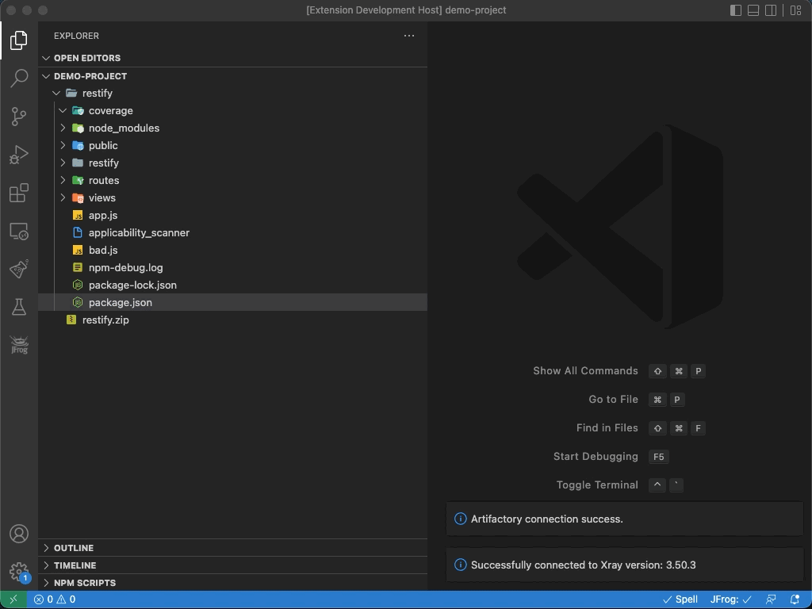
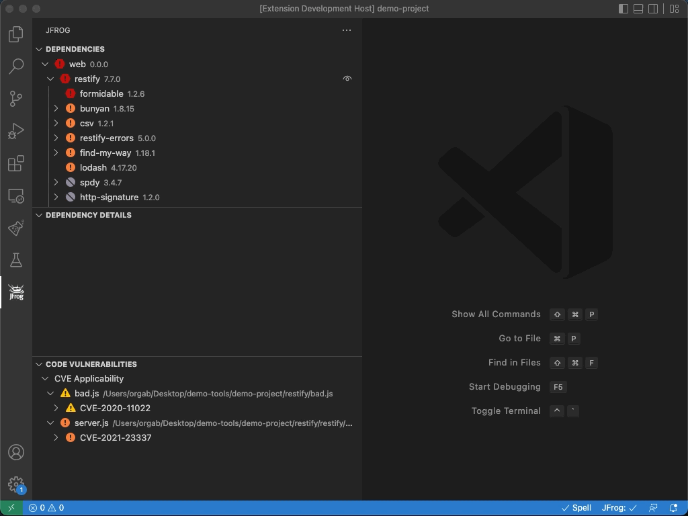
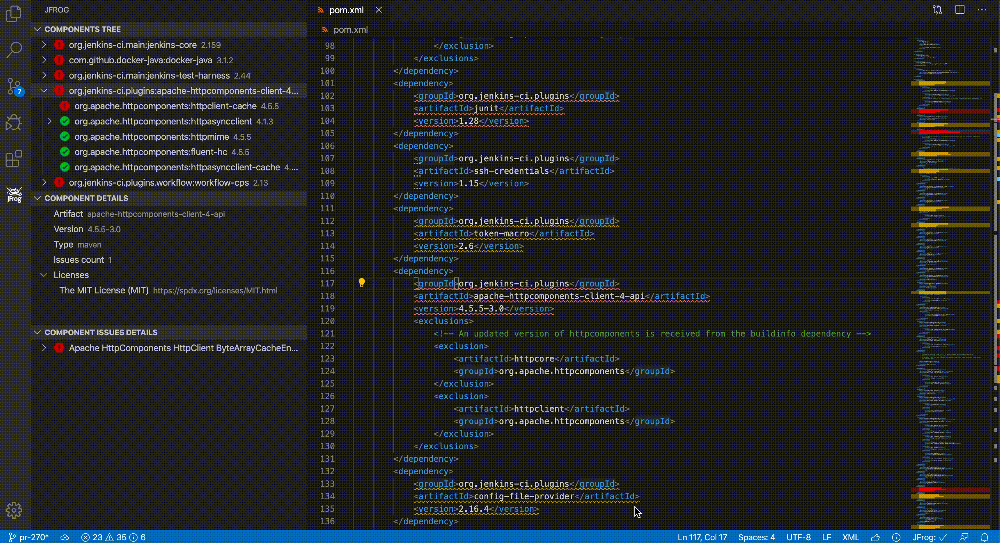
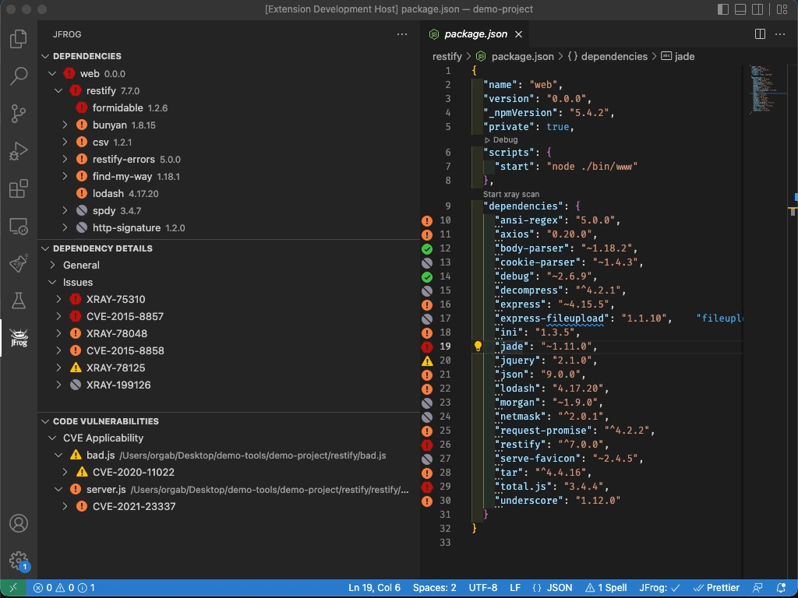
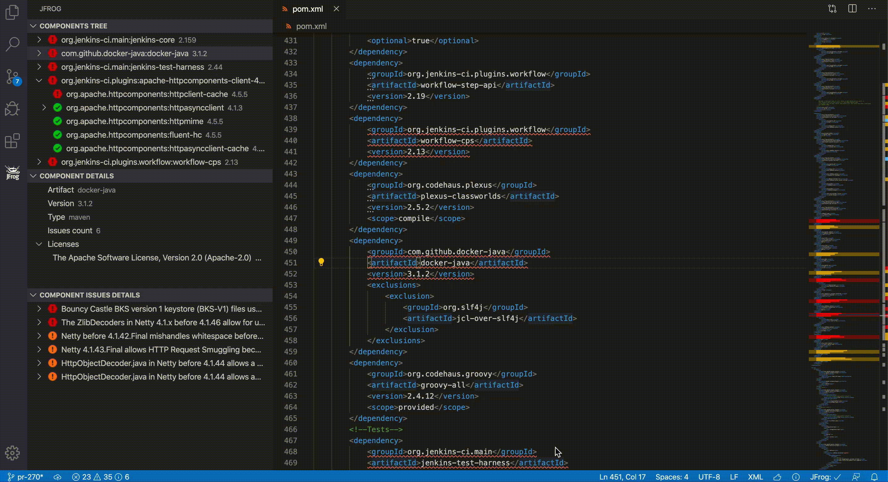
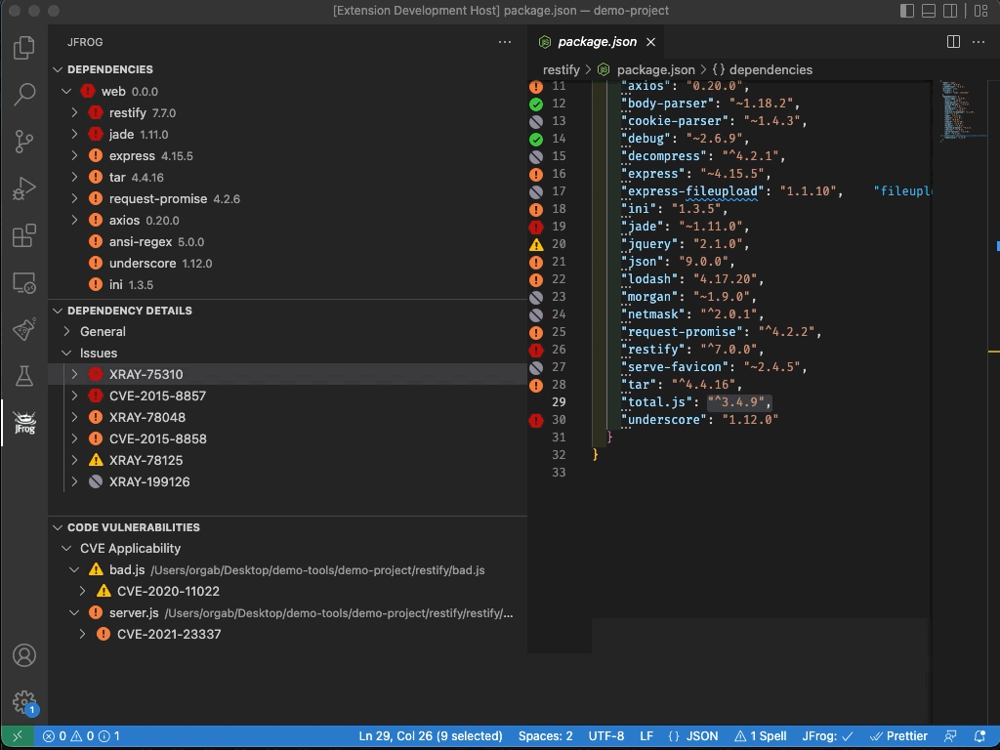
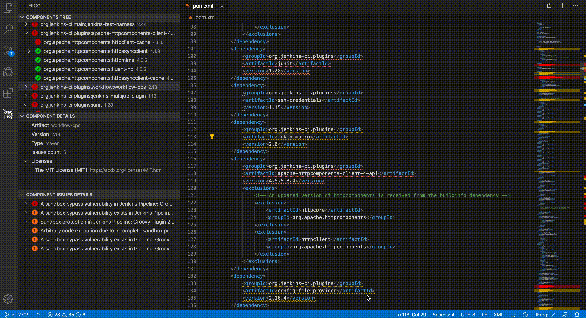
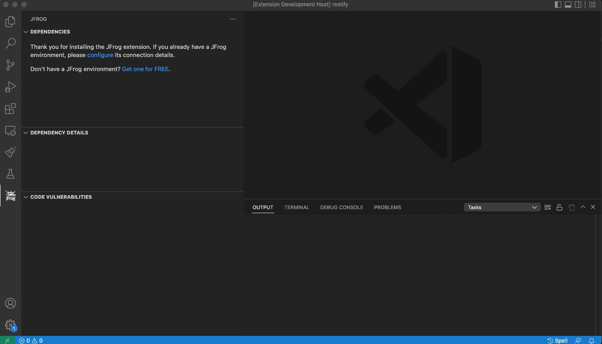
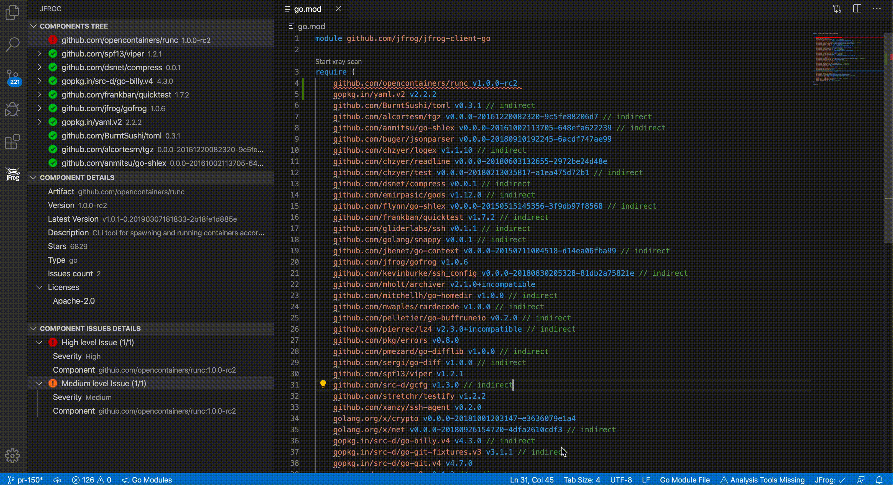
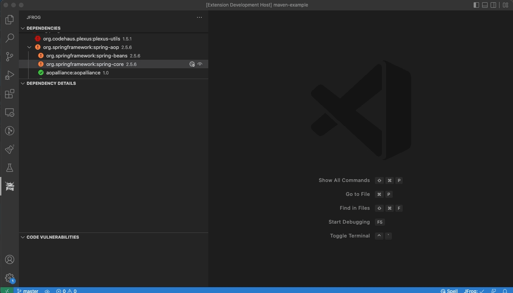

# JFrog Visual Studio Code Extension

[](https://marketplace.visualstudio.com/items?itemName=JFrog.jfrog-vscode-extension)

# Table of Contents

- [About this Extension](#about-this-extension)
  - [General](#general)
  - [Free Go Modules Security Scanning and Metadata from GoCenter](#free-go-modules-security-scanning-and-metadata-from-gocenter)
- [Viewing Project Dependencies Information](#viewing-project-dependencies-information)
- [General Configuration](#general-configuration)
  - [Configuring JFrog Xray](#configuring-jfrog-xray)
  - [Proxy Configuration](#proxy-configuration)
    - [Proxy Authorization](#proxy-authorization)
  - [Exclude Paths from Scan](#exclude-paths-from-scan)
  - [Extension Settings](#extension-settings)
- [Go Projects](#go-projects)
- [Maven Projects](#maven-projects)
- [Npm Projects](#npm-projects)
- [Pypi Projects](#pypi-projects)
- [.NET Projects](#net-projects)
- [Troubleshooting](#troubleshooting)
- [License](#license)
- [Building and Testing the Sources](#building-and-testing-the-sources)
- [Code Contributions](#code-contributions)
  - [Guidelines](#guidelines)

## About this Extension
### General
The cost of remediating a vulnerability is akin to the cost of fixing a bug.
The earlier you remediate a vulnerability in the release cycle, the lower the cost.
[JFrog Xray](https://jfrog.com/xray/) is instrumental in flagging components when vulnerabilities are discovered in production systems at runtime,
or even sooner, during the development.

The JFrog VS Code Extension adds JFrog Xray scanning of project dependencies to your VS Code IDE.
It allows developers to view panels displaying vulnerability information about the components and their dependencies directly in their VS Code IDE.
With this information, a developer can make an informed decision on whether to use a component or not before it gets entrenched into the organization’s product. The following project types are supported.
- [Go Projects](#go-projects)
- [Maven Projects](#maven-projects)
- [Npm Projects](#npm-projects)
- [Pypi Projects](#pypi-projects)
- [.NET Projects](#net-projects)

### Free Go Modules Security Scanning and Metadata from GoCenter
The JFrog Extension also includes free security scanning and metadata of Go Modules from [JFrog GoCenter](https://search.gocenter.io/). Read more in the [Go Projects](#go-projects) section.

## Viewing Project Dependencies Information
View the dependencies used by the project in a tree, where the direct dependencies are at the top.


The JFrog extension automatically triggers a scan of the project's dependencies whenever a change is detected after building the code.
To invoke a scan manually, click on the Refresh  button or click on *Start Xray Scan* from within the editor.


View the security information for a depedency by hovering over it in the editor.
You can also navigate from the depedency declaration directly into the tree view. This allows you to see transitive (indirect) depedencies.


Search for a dependency in the tree:


View the issues associated with direct and transitive (indirect) dependencies.


To filter the dependencies viewed, click on the Filter  button.


Navigate from the tree view to a depedency's declaration in the editor.


## General Configuration
### Configuring JFrog Xray
Connect to JFrog Xray by clicking on the green Connect  button:


The extension also support connecting to JFrog Xray using environment variables.

Note: For security reasons, it is recommended to unset the environment variables after launching VS Code.

- `JFROG_IDE_URL` - JFrog Xray URL
- `JFROG_IDE_USERNAME` - JFrog Xray username
- `JFROG_IDE_PASSWORD` - JFrog Xray password
- `JFROG_IDE_STORE_CONNECTION` - Set the value of this environment variable to **true**, if you'd like VS Code to store the connection details after reading them from the environment variables.

### Proxy Configuration
If your JFrog Xray instance is behind an HTTP/S proxy, follow these steps to configure the proxy server:

1. Go to Preferences --> Settings --> Application --> Proxy
1. Set the proxy URL under 'Proxy'.
1. Make sure 'Proxy Support' is 'override' or 'on'.

- Alternatively, you can use the HTTP_PROXY and HTTPS_PROXY environment variables.

#### Proxy Authorization
If your proxy server requires credentials, follow these steps:

1. Follow 1-3 steps under [Proxy configuration](#proxy-configuration).
1. Encode with base64: `[Username]:[Password]`.
1. Under 'Proxy Authorization' click on 'Edit in settings.json'.
1. Add to settings.json: `"http.proxyAuthorization": "Basic [Encoded credentials]"`.

##### Example
- `Username: foo`
- `Password: bar`

settings.json:

```json
{
   "http.proxyAuthorization": "Basic Zm9vOmJhcg=="
}
```

### Exclude Paths from Scan
By default, paths containing the words `test`, `venv` and `node_modules` are excluded from Xray scan.
The exclude pattern can be configured in the [Extension Settings](#extension-settings).

### Extension Settings
To open the extension settings, use the following VS Code menu command:

- On Windows/Linux - File > Preferences > Settings > Extensions > JFrog
- On macOS - Code > Preferences > Settings > Extensions > JFrog

## Go Projects
### Free Security Scanning and Metadata from GoCenter
Go Modules in GoCenter are scanned by Xray. You can read more about it in [this](https://jfrog.com/blog/gocenter-reveals-go-module-vulnerabilities-with-xray/) blog. The JFrog VS Code Extension pulls this security information from GoCenter and displays it inside the IDE. It also displays, for each module, the description summary, license and the number of stars.


For each module there's a direct link to the GoCenter UI, with more information, like the actual CVEs, as well as other projects which use this module.


### Enhanced Capabilities with JFrog Xray
By [connecting VS Code to JFrog Xray](#configuring-jfrog-xray) the security information is pulled directly from JFrog Xray. This means that more security information becomes available to the developers inside VS Code. This includes the list of security issues, including the module versions with the fixes.
All the module metadata provided by GoCenter is still available when connecting to JFrog Xray.

### Behind the Scenes
The JFrog VS Code Extension scans all of the project depedencies, both direct and indirect (transitive), even if they are not declared in the project's go.mod. It builds the Go dependencies tree by running `go mod graph`. Therefore, please make sure to have Go CLI in your system PATH.

## Maven Projects

### Excluding transitive dependency in pom.xml
To exclude a transitive dependency from your project, click on the "Exclude dependency" button in the dependencies tree.


### Behind the Scenes
The JFrog VS Code Extension builds the Maven dependencies tree by running `mvn dependency:tree`. View licenses and top issue severities directly from the pom.xml.

Important notes:
1. To have your project dependencies scanned by JFrog Xray, make sure Maven is installed, and that the mvn command is in your system PATH.
2. For projects which include the [Maven Dependency Plugin](https://maven.apache.org/plugins/maven-dependency-plugin/examples/resolving-conflicts-using-the-dependency-tree.html) as a build plugin, with include or exclude configurations, the scanning functionality is disabled. For example:
```xml
      <plugins>
        <plugin>
          <groupId>org.apache.maven.plugins</groupId>
          <artifactId>maven-dependency-plugin</artifactId>
          <configuration>
            <includes>org.apache.*</includes>
          </configuration>
        </plugin>
      </plugins>
```

## Npm Projects
Behind the scenes, the extension builds the npm dependencies tree by running `npm list`. View licenses and top issue severities directly from the package.json.

Important:
To have your project dependencies scanned by JFrog Xray, make sure the npm CLI is installed on your local machine and that it is in your system PATH.
In addition, the project dependencies must be installed using `npm install`.

## Pypi Projects
Behind the scenes, the extension builds the Pypi dependencies tree by running `pipdeptree` on your Python virtual environment. It also uses the Python interpreter path configured by the [Python extension](https://marketplace.visualstudio.com/items?itemName=ms-python.python). View licenses and top issue severities directly from your requirements.txt files. The scan your Pypi dependencies, make sure the following requirements are met:

1. The [Python extension for VS Code](https://code.visualstudio.com/docs/python/python-tutorial#_install-visual-studio-code-and-the-python-extension) is installed.
2. Depending on your project, Please make sure Python 2 or 3 are included in your system PATH.
3. Create and activate a virtual env as instructed in [VS-Code documentation](https://code.visualstudio.com/docs/python/environments#_global-virtual-and-conda-environments). Make sure that Virtualenv Python interpreter is selected as instructed [here](https://code.visualstudio.com/docs/python/environments#_select-and-activate-an-environment).
4. Open a new terminal and activate your Virtualenv:
    * On macOS and Linux:
      ```sh
      source <venv-dir>/bin/activate

      # For example:
      source .env/bin/activate
      ```
    * On Windows:
      ```powershell
      .\<venv-dir>\Scripts\activate

      # For example:
      .\env\Scripts\activate
      ```
5. In the same terminal, install your python project and dependencies according to your project specifications.

## .NET Projects
For .NET projects which use NuGet packages as depedencies, the extension displays the NuGet depedencies tree, together with the information for each depedency.  
Behind the scenes, the extension builds the NuGet dependencies tree using the [NuGet deps tree](https://github.com/jfrog/nuget-deps-tree) npm package.

Important:
- Does your project define its NuGet depedencies using a *packages.config* file? If so, then please make sure the `nuget` CLI is installed on your local machine and that it is in your system PATH. The extension uses the `nuget` CLI to find the location of the NuGet packages on the local file-system.
- The project must be restored using `nuget restore` or `dotnet restore` prior to scanning. After this action, you should click on the Refresh  button, for the tree view to be refreshed and updated.

## Troubleshooting
View the extension log:


## License
The extension is licensed under [Apache License 2.0](LICENSE).

## Building and Testing the Sources
To build the extension sources, please follow these steps:

1. Clone the code from Github.
1. Build and create the VS-Code extension vsix file by running the following npm command.

```bash
npm i
npm run package
```

   After the build finishes, you'll find the vsix file in the _jfrog-vscode-extension_ directory.
   The vsix file can be loaded into VS-Code

To run the tests:

```bash
npm t
```

## Code Contributions
We welcome community contribution through pull requests.

### Guidelines
- Before creating your first pull request, please join our contributors community by signing [JFrog's CLA](https://secure.echosign.com/public/hostedForm?formid=5IYKLZ2RXB543N).
- If the existing tests do not already cover your changes, please add tests.
- Pull requests should be created on the _dev_ branch.
- Please run `npm run format` for formatting the code before submitting the pull request.
