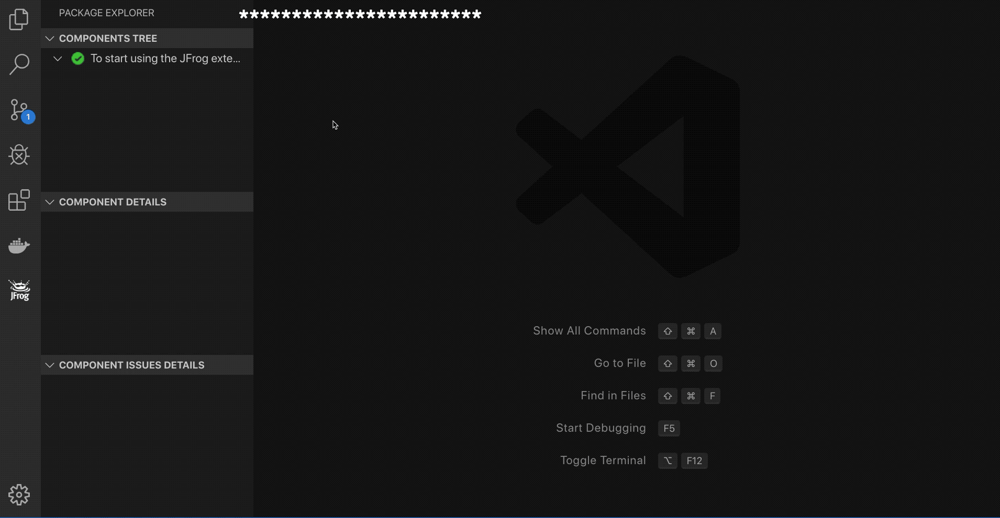
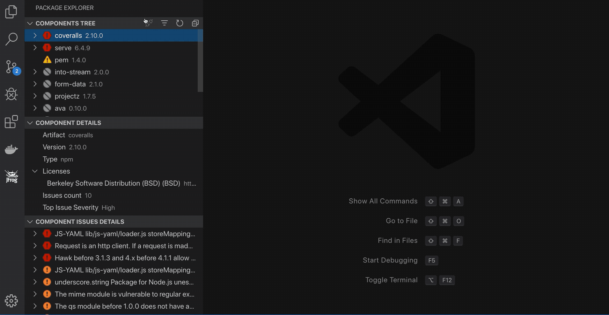

# JFrog Visual Studio Code Extension

## General

The cost of remediating a vulnerability is akin to the cost of fixing a bug.
The earlier you remediate a vulnerability in the release cycle, the lower the cost.
JFrog Xray is instrumental in flagging components when vulnerabilities are discovered in production systems at runtime,
or even sooner, during the development.

The JFrog VS Code Extension adds JFrog Xray scanning of npm project dependencies to your VS Code IDE.
It allows developers to view panels displaying vulnerability information about the components and their dependencies directly in their VS Code IDE.
With this information, a developer can make an informed decision on whether to use a component or not before it gets entrenched into the organization’s product.

## Using JFrog Visual Studio Code Extension

Connect to JFrog Xray by clicking on the green Connect  button:


View the project's dependency tree


The JFrog extension automatically triggers a scan of the project's npm dependencies whenever a change in the **package-lock.json** file is detected.
To invoke a scan manually, click on the Refresh  button or click on *Start Xray Scan* from within the **package.json** (above the *dependencies* section).


View existing issues


View licenses directly from within the **package.json**:


View additional information about a dependency:


View dependency in package.json:


Search in tree:


To filter scan results, click on the Filter  button.


## Building and Testing the Sources

To build the extension sources, please follow these steps:

1. Clone the code from Github.
1. Build and create the VS-Code extension vsix file by running the following npm command.

```bash
npm run package
```

   After the build finishes, you'll find the vsix file in the _jfrog-vscode-extension_ directory.
   The vsix file can be loaded into VS-Code

To run the tests:

```bash
npm t
```

## Code contributions

We welcome community contribution through pull requests.

### Guidelines

- Before creating your first pull request, please join our contributors community by signing [JFrog's CLA](https://secure.echosign.com/public/hostedForm?formid=5IYKLZ2RXB543N).
- If the existing tests do not already cover your changes, please add tests.
- Pull requests should be created on the _dev_ branch.
- Please run `npm run format` for formatting the code before submitting the pull request.
