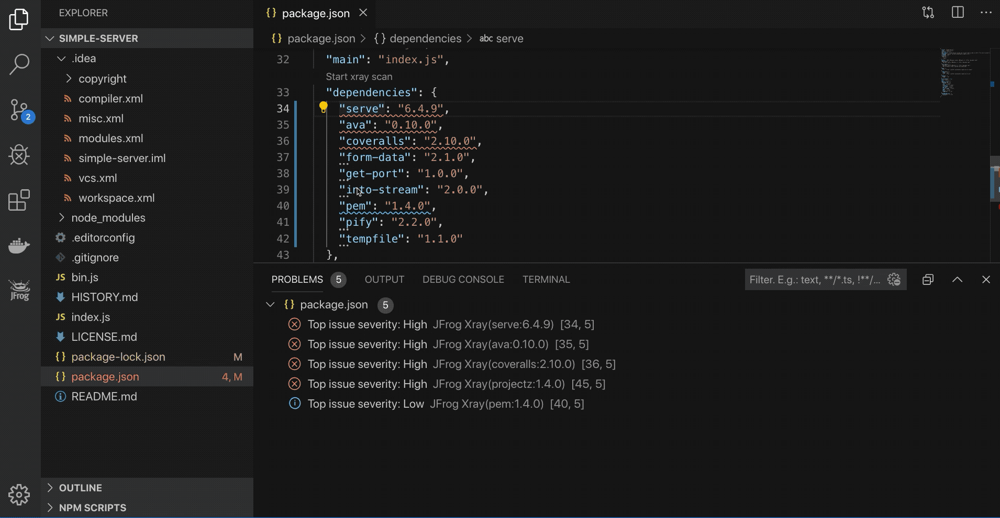
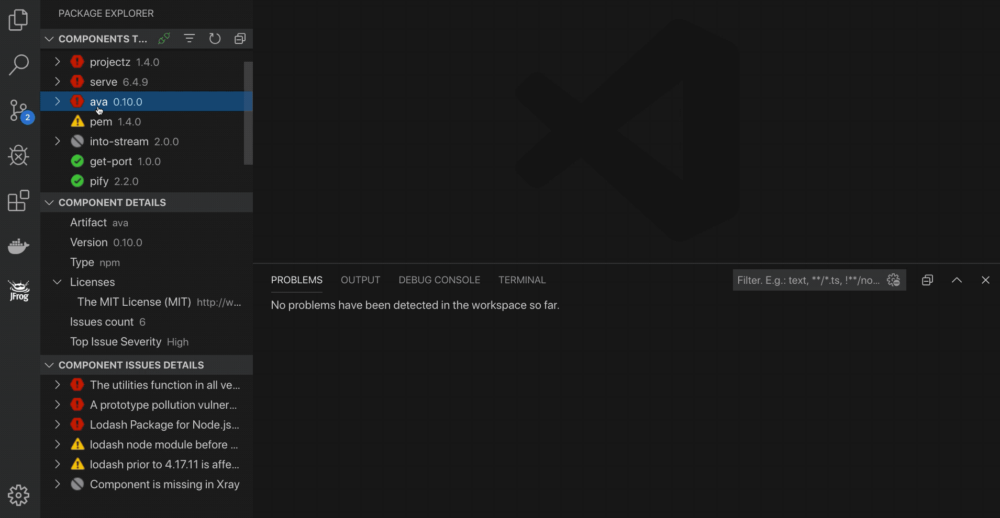

# JFrog Visual Studio Code Extension

[](https://marketplace.visualstudio.com/items?itemName=JFrog.jfrog-vscode-extension)

# Table of Contents

- [General](#general)
- [Viewing Project Dependencies Information](#viewing-project-dependencies-information)
- [General Configuration](#general-configuration)
  - [Configuring JFrog Xray](#configuring-jfrog-xray)
  - [Proxy Configuration](#proxy-configuration)
    - [Proxy Authorization](#proxy-authorization)
  - [Exclude Paths from Scan](#exclude-paths-from-scan)
  - [Extension Settings](#extension-settings)
- [Maven Projects](#maven-projects)
- [Npm Projects](#npm-projects)
- [Go Projects](#go-projects)
- [Pypi Projects](#pypi-projects)
- [Troubleshooting](#troubleshooting)
- [License](#license)
- [Building and Testing the Sources](#building-and-testing-the-sources)
- [Code Contributions](#code-contributions)
  - [Guidelines](#guidelines)

## General

The cost of remediating a vulnerability is akin to the cost of fixing a bug.
The earlier you remediate a vulnerability in the release cycle, the lower the cost.
JFrog Xray is instrumental in flagging components when vulnerabilities are discovered in production systems at runtime,
or even sooner, during the development.

The JFrog VS Code Extension adds JFrog Xray scanning of **maven**, **npm**, **Go** and **Python** project dependencies to your VS Code IDE.
It allows developers to view panels displaying vulnerability information about the components and their dependencies directly in their VS Code IDE.
With this information, a developer can make an informed decision on whether to use a component or not before it gets entrenched into the organization’s product.

## Viewing Project Dependencies Information

View the dependencies used by the project in a tree, where the direct dependencies are at the top:


The JFrog extension automatically triggers a scan of the project's npm dependencies whenever a change in the **package-lock.json** file is detected.
To invoke a scan manually, click on the Refresh  button or click on *Start Xray Scan* from within the editor:


View existing issues:


View licenses directly from within the *package.json*, *requirements.txt* or *go.mod*:


View additional information about a dependency:


View dependency in *package.json*, *requirements.txt* or *go.mod*:


Search for a dependency in the tree:


To filter scan results, click on the Filter  button:


## General Configuration

### Configuring JFrog Xray

Connect to JFrog Xray by clicking on the green Connect  button:


### Proxy Configuration

If your JFrog Xray instance is behind an HTTP/S proxy, follow these steps to configure the proxy server:

1. Go to Preferences --> Settings --> Application --> Proxy
1. Set the proxy URL under 'Proxy'.
1. Make sure 'Proxy Support' is 'override' or 'on'.

- Alternatively, you can use the HTTP_PROXY and HTTPS_PROXY environment variables.

#### Proxy Authorization

If your proxy server requires credentials, follow these steps:

1. Follow 1-3 steps under [Proxy configuration](#proxy-configuration).
1. Encode with base64: `[Username]:[Password]`.
1. Under 'Proxy Authorization' click on 'Edit in settings.json'.
1. Add to settings.json: `"http.proxyAuthorization": "Basic [Encoded credentials]"`.

##### Example

- `Username: foo`
- `Password: bar`

settings.json:

```json
{
   "http.proxyAuthorization": "Basic Zm9vOmJhcg=="
}
```

### Exclude Paths from Scan

By default, paths containing the words `test`, `venv` and `node_modules` are excluded from Xray scan.
The exclude pattern can be configured in the [Extension Settings](#extension-settings).

### Extension Settings

To open the extension settings, use the following VS Code menu command:

- On Windows/Linux - File > Preferences > Settings > Extensions > JFrog
- On macOS - Code > Preferences > Settings > Extensions > JFrog

## Maven Projects

Behind the scenes, the extension builds the maven dependencies tree by running `mvn dependency:tree`. View licenses and top issue severities directly from the pom.xml.

Important notes:
1. To have your project dependencies scanned by JFrog Xray, make sure maven is installed, and that the mvn command is in your system PATH.
2. For projects which include the [dependency:tree](https://maven.apache.org/plugins/maven-dependency-plugin/examples/resolving-conflicts-using-the-dependency-tree.html) plugin as a depedency, the scanning functionality is disabled.

## Npm Projects

Behind the scenes, the extension builds the npm dependencies tree by running `npm list`. View licenses and top issue severities directly from the package.json.

Important:
To have your project dependencies scanned by JFrog Xray, make sure the npm CLI is installed on your local machine and that it is in your system PATH.
In addition, the project dependencies must be installed using npm.

## Go Projects

Behind the scenes, the extension builds the Go dependencies tree by running `go mod graph`. View licenses and top issue severities directly from go.mod.
To scan your Go dependencies, just make sure to have Go CLI in your system PATH.

## Pypi Projects

Behind the scenes, the extension builds the Pypi dependencies tree by running `pipdeptree` on your Python virtual environment. It also uses the Python interpreter path configured by the [Python extension](https://marketplace.visualstudio.com/items?itemName=ms-python.python). View licenses and top issue severities directly from your requirements.txt files. The scan your Pypi dependencies, make sure the following requirements are met:

1. The [Python extension for VS Code](https://code.visualstudio.com/docs/python/python-tutorial#_install-visual-studio-code-and-the-python-extension) is installed.
1. Depending on your project, Python 2 or 3 most be your system PATH.
1. Create and activate a virtual env as instructed in [VS-Code documentation](https://code.visualstudio.com/docs/python/environments#_global-virtual-and-conda-environments). Make sure that Virtualenv Python interpreter is selected as instructed [here](https://code.visualstudio.com/docs/python/environments#_select-and-activate-an-environment).
1. Open a new terminal and activate your Virtualenv as instructed [here](https://virtualenv.pypa.io/en/latest/userguide/#activate-script).
1. Install your python project and dependencies according to your project specifications.

## Troubleshooting

View the extension log:


## License

The extension is licensed under [Apache License 2.0](LICENSE).

## Building and Testing the Sources

To build the extension sources, please follow these steps:

1. Clone the code from Github.
1. Build and create the VS-Code extension vsix file by running the following npm command.

```bash
npm i
npm run package
```

   After the build finishes, you'll find the vsix file in the _jfrog-vscode-extension_ directory.
   The vsix file can be loaded into VS-Code

To run the tests:

```bash
npm t
```

## Code Contributions

We welcome community contribution through pull requests.

### Guidelines

- Before creating your first pull request, please join our contributors community by signing [JFrog's CLA](https://secure.echosign.com/public/hostedForm?formid=5IYKLZ2RXB543N).
- If the existing tests do not already cover your changes, please add tests.
- Pull requests should be created on the _dev_ branch.
- Please run `npm run format` for formatting the code before submitting the pull request.
