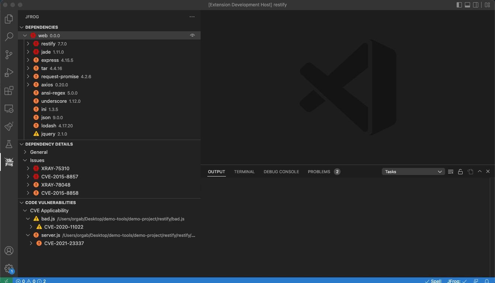

[](#readme)

<div align="center">

# JFrog Extension for VS Code & Eclipse Theia


[](https://marketplace.visualstudio.com/items?itemName=JFrog.jfrog-vscode-extension) [](https://open-vsx.org/extension/JFrog/jfrog-vscode-extension)
[](https://github.com/jfrog/jfrog-vscode-extension/actions/workflows/test.yml)
</div>

# Table of Contents
- [JFrog Extension for VS Code & Eclipse Theia](#jfrog-extension-for-vs-code--eclipse-theia)
- [Table of Contents](#table-of-contents)
  - [About this Extension](#about-this-extension)
  - [Getting Started](#getting-started)
  - [Set Up a FREE JFrog Environment in the Cloud](#set-up-a-free-jfrog-environment-in-the-cloud)
  - [Connecting VS Code to Your JFrog Environment](#connecting-vs-code-to-your-jfrog-environment)
  - [Applying Your Xray Policies](#applying-your-xray-policies)
  - [Proxy Configuration](#proxy-configuration)
    - [Proxy Authorization](#proxy-authorization)
      - [Example](#example)
  - [Extension Settings](#extension-settings)
  - [Using the Extension](#using-the-extension)
  - [The Local View](#the-local-view)
    - [Supported Features](#supported-features)
    - [Dependencies Tree Icons](#dependencies-tree-icons)
    - [Viewing and Updating Project Dependencies](#viewing-and-updating-project-dependencies)
    - [Scan after dependencies change](#scan-after-dependencies-change)
    - [CVE Applicability](#cve-applicability)
    - [Exclude Paths from Scan](#exclude-paths-from-scan)
    - [Go Projects](#go-projects)
    - [Maven Projects](#maven-projects)
      - [Excluding transitive dependency in pom.xml](#excluding-transitive-dependency-in-pomxml)
      - [Behind the Scenes](#behind-the-scenes)
    - [Npm Projects](#npm-projects)
    - [Yarn v1 Projects](#yarn-v1-projects)
    - [Pypi Projects](#pypi-projects)
    - [.NET Projects](#net-projects)
  - [The CI View](#the-ci-view)
    - [How Does It Work?](#how-does-it-work)
    - [Setting Up Your CI Pipeline](#setting-up-your-ci-pipeline)
    - [Setting Up the CI View](#setting-up-the-ci-view)
  - [Troubleshooting](#troubleshooting)
  - [License](#license)
  - [Building and Testing the Sources](#building-and-testing-the-sources)
    - [Preconditions](#preconditions)
  - [Code Contributions](#code-contributions)
    - [Guidelines](#guidelines)

## About this Extension
The cost of remediating a vulnerability is akin to the cost of fixing a bug.
The earlier you remediate a vulnerability in the release cycle, the lower the cost.
[JFrog Xray](https://jfrog.com/xray/) is instrumental in flagging components when vulnerabilities are discovered in production systems at runtime,
or even sooner, during the development.

The JFrog VS Code Extension adds JFrog Xray scanning of project dependencies to your VS Code IDE. It allows developers to view panels displaying vulnerability information about the components and their dependencies directly in their VS Code IDE. The extension also allows developers to track the status of the code while it is being built, tested and scanned on the CI server.
Lastly, CVE Applicability scans allow you to see exactly where the CVEs originate in your source code.

The extension also applies [JFrog File Spec JSON schema](https://raw.githubusercontent.com/jfrog/jfrog-cli/master/schema/filespec-schema.json) on the following file patterns: `**/filespecs/*.json`, `*filespec*.json` and `*.filespec`. Read more about JFrog File specs [here](https://www.jfrog.com/confluence/display/JFROG/FileSpec).

## Getting Started
1. Install the **JFrog** extension in VS Code
2. Need a FREE JFrog environment in the cloud? [Create one now and connect VS Code to it](#set-up-a-free-jfrog-environment-in-the-cloud)
3. Already have a working JFrog environment? [Connect VS Code to it](#connecting-vs-code-to-your-jfrog-environment)
4. [Start](#using-the-extension) using the extension

## Set Up a FREE JFrog Environment in the Cloud
Need a FREE JFrog environment in the cloud, so that VS Code can connect to it? Just run one of the following commands in your terminal. The commands will do the following:

1. Install JFrog CLI on your machine.
2. Create a FREE JFrog environment in the cloud for you.
3. Configure VS Code to connect to your new environment.

**MacOS and Linux using cUrl**
```
curl -fL https://getcli.jfrog.io?setup | sh
```

**Windows using PowerShell**
```
powershell "Start-Process -Wait -Verb RunAs powershell '-NoProfile iwr https://releases.jfrog.io/artifactory/jfrog-cli/v2-jf/[RELEASE]/jfrog-cli-windows-amd64/jf.exe -OutFile $env:SYSTEMROOT\system32\jf.exe'" ; jf setup
```

## Connecting VS Code to Your JFrog Environment
Connect to your JFrog environment by clicking on the green Connect  button:


You can leave the platform URL empty, to enter the separate URLs for Artifactory and Xray.

The extension also supports connecting to your JFrog environment using environment variables. You may provide basic auth credentials or access token as follows:

Note: For security reasons, it is recommended to unset the environment variables after launching VS Code.

- `JFROG_IDE_URL` - JFrog URL
- `JFROG_IDE_USERNAME` - JFrog username
- `JFROG_IDE_PASSWORD` - JFrog password
- `JFROG_IDE_ACCESS_TOKEN` - JFrog access token
- `JFROG_IDE_STORE_CONNECTION` - Set the value of this environment variable to **true**, if you'd like VS Code to store the connection details after reading them from the environment variables.

## Applying Your Xray Policies
You can configure the JFrog VS-Code extension to reflect the Security Policies. The policies are configured in JFrog Xray.

If you'd like to use a JFrog Project that is associated with the policy, follow these steps:
1. Create a [JFrog Project](https://www.jfrog.com/confluence/display/JFROG/Projects), or obtain the relevant JFrog Project key.
1. Create a [Policy](https://www.jfrog.com/confluence/display/JFROG/Creating+Xray+Policies+and+Rules) on JFrog Xray.
1. Create a [Watch](https://www.jfrog.com/confluence/display/JFROG/Configuring+Xray+Watches) on JFrog Xray and assign your Policy and Project as resources to it.
1. Configure your Project key in the [Extension Settings](#extension-settings).

If however your policies are referenced through an Xray Watch or Watches, follow these steps instead:
1. Create one or more [Watches](https://www.jfrog.com/confluence/display/JFROG/Configuring+Xray+Watches) on JFrog Xray.
1. Configure your Watches in the [Extension Settings](#extension-settings).

## Proxy Configuration
If your JFrog environment is behind an HTTP/S proxy, follow these steps to configure the proxy server:

1. Go to Preferences --> Settings --> Application --> Proxy
1. Set the proxy URL under 'Proxy'.
1. Make sure 'Proxy Support' is 'override' or 'on'.

- Alternatively, you can use the HTTP_PROXY and HTTPS_PROXY environment variables.

### Proxy Authorization
If your proxy server requires credentials, follow these steps:

1. Follow 1-3 steps under [Proxy configuration](#proxy-configuration).
1. Encode with base64: `[Username]:[Password]`.
1. Under 'Proxy Authorization' click on 'Edit in settings.json'.
1. Add to settings.json: `"http.proxyAuthorization": "Basic [Encoded credentials]"`.

#### Example
- `Username: foo`
- `Password: bar`

settings.json:

```json
{
   "http.proxyAuthorization": "Basic Zm9vOmJhcg=="
}
```

## Extension Settings
To open the extension settings, use the following VS Code menu command:

- On Windows/Linux - File > Preferences > Settings > Extensions > JFrog
- On macOS - Code > Preferences > Settings > Extensions > JFrog

## Using the Extension
The extension offers two modes, **Local** and **CI**.
The two modes can be toggled by pressing on their respective buttons that will appear next to the components tree.

- The **Local** view displays information about the local code as it is being developed in VS Code. JFrog Xray continuously scans the project's dependencies and source code locally. The information is displayed in the **Local** view.
- The **CI** view allows the tracking of the code as it is built, tested and scanned by the CI server. It displays information about the status of the build and includes a link to the build log on the CI server.

## The Local View
The local view of the extension adds JFrog Xray scanning of project dependencies to your VS Code IDE.
It allows developers to view panels displaying vulnerability information about their dependencies and source code in their VS Code IDE.
With this information, a developer can make an informed decision on whether to use a component or not before it gets entrenched into the organization’s product.

### Supported Features
| Features                                                | [Go](#go-projects) | [Maven](#maven-projects) | [npm](#npm-projects) | [Yarn v1](#yarn-v1-projects) | [Pypi](#pypi-projects) | [.NET](#net-projects) |
| ------------------------------------------------------- | :----------------: | :----------------------: | :------------------: | :--------------------: | :--------------------: | :-------------------: |
| Issues and licenses scanning                            |         ✅         |            ✅            |          ✅          |           ✅           |           ✅           |          ✅           |
| Filter dependencies by severity, license, and scope     |         ✅         |            ✅            |          ✅          |           ✅           |           ✅           |          ✅           |
| Trigger scan on startup                                 |         ✅         |            ✅            |          ✅          |           ✅           |           ✅           |          ✅           |
| Jump from dependency tree to project descriptor         |         ✅         |            ✅            |          ✅          |           ✅           |           ✅           |          ❌           |
| Jump from project descriptor to dependency tree         |         ✅         |            ✅            |          ✅          |           ✅           |           ✅           |          ❌           |
| Show vulnerabilities inside the project descriptor      |         ✅         |            ✅            |          ✅          |           ✅           |           ✅           |          ❌           |
| Upgrade vulnerable dependencies to fixed versions       |         ✅         |            ✅            |          ✅          |           ✅           |           ❌           |          ❌           |
| Automatically trigger a scan upon code changes          |         ✅         |            ❌            |          ✅          |           ✅           |           ❌           |          ❌           |
| Source code scanning for CVE Applicability              |         ❌         |            ❌            |          ✅          |           ✅           |           ✅            |          ❌           |
| Exclude transitive dependencies from project descriptor |         ❌         |            ✅            |          ❌          |           ❌           |           ❌           |          ❌           |


### Dependencies Tree Icons
The icon demonstrates the top severity issue of a selected component and its transitive dependencies. The following table describes the severities from lowest to highest:

|                 Icon                | Severity |                                       Description                                      |
|:-----------------------------------:|:--------:|:---------------------------------------------------------------------------------------|
|      |  Normal  | Scanned - No Issues                                                                    |
|    |  Unknown | No CVEs attached to the vulnerability or the selected component not identified in Xray |
|            |    Low   | Top issue with low severity                                                            |
|      |  Medium  | Top issue with medium severity                                                         |
|          |   High   | Top issue with high severity                                                           |
|  | Critical | Top issue with critical severity                                                       |

### Viewing and Updating Project Dependencies
View the dependencies used by the project in a tree, where the direct dependencies are at the top.


The JFrog extension automatically triggers a scan of the project's dependencies whenever a change is detected after building the code.
To invoke a scan manually, click on the Refresh  button or click on *Start Xray Scan* from within the editor.


View the security information for a dependency by hovering over it in the editor.
You can also navigate from the dependency declaration directly into the tree view. This allows you to see transitive (indirect) dependencies.


Search for a dependency in the tree:


View the issues associated with direct and transitive (indirect) dependencies.


Update a vulnerable dependency to a fixed version:


To filter the dependencies viewed, click on the Filter  button.


Navigate from the tree view to a dependency's declaration in the editor.


### Scan after dependencies change
The JFrog VS-Code extension can trigger an Xray scan after a change in go.sum or package-lock.json.
This feature is disabled by default. You can enable it in the [Extension Settings](#extension-settings).

### CVE Applicability
Scans for third-party APIs in the source code that contains a vulnerabilities.
Upon completion of the scan, a list of files will be displayed under the _code vulnerabilities_ section. In every file, there are at least one or more security-impacted APIs used by third-party dependencies.


### Exclude Paths from Scan
By default, paths containing the words `test`, `venv` and `node_modules` are excluded from Xray scan.
The exclude pattern can be configured in the [Extension Settings](#extension-settings).

### Go Projects

Behind the scenes, the JFrog VS Code Extension scans all the project dependencies, both direct and indirect (transitive), even if they are not declared in the project's go.mod. It builds the Go dependencies tree by running `go mod graph` and intersecting the results with `go list -f '{{with .Module}}{{.Path}} {{.Version}}{{end}}' all` command. Therefore, please make sure to have Go CLI in your system PATH.

### Maven Projects

#### Excluding transitive dependency in pom.xml
To exclude a transitive dependency from your project, click on the "Exclude dependency" button in the dependencies tree.


#### Behind the Scenes
The JFrog VS Code Extension builds the Maven dependencies tree by running `mvn dependency:tree`. View licenses and top issue severities directly from the pom.xml.

Important notes:
1. To have your project dependencies scanned by JFrog Xray, make sure Maven is installed, and that the mvn command is in your system PATH.
2. For projects which include the [Maven Dependency Plugin](https://maven.apache.org/plugins/maven-dependency-plugin/examples/resolving-conflicts-using-the-dependency-tree.html) as a build plugin, with include or exclude configurations, the scanning functionality is disabled. For example:
```xml
      <plugins>
        <plugin>
          <groupId>org.apache.maven.plugins</groupId>
          <artifactId>maven-dependency-plugin</artifactId>
          <configuration>
            <includes>org.apache.*</includes>
          </configuration>
        </plugin>
      </plugins>
```

### Npm Projects
Behind the scenes, the extension builds the npm dependencies tree by running `npm list`. View licenses and top issue severities directly from the package.json.

Important:
To have your project dependencies scanned by JFrog Xray, make sure the npm CLI is installed on your local machine and that it is in your system PATH.
In addition, the project dependencies must be installed using `npm install`.

### Yarn v1 Projects
Behind the scenes, the extension builds the Yarn dependencies tree by running `yarn list`. View licenses and top issue severities directly from the yarn.lock.

Important:
- To have your project dependencies scanned by JFrog Xray, make sure the Yarn CLI is installed on your local machine and that it is in your system PATH.
- Yarn v2 is not yet supported.

### Pypi Projects
Behind the scenes, the extension builds the Pypi dependencies tree by running `pipdeptree` on your Python virtual environment. It also uses the Python interpreter path configured by the [Python extension](https://marketplace.visualstudio.com/items?itemName=ms-python.python). View licenses and top issue severities directly from your requirements.txt files. The scan your Pypi dependencies, make sure the following requirements are met:

1. The [Python extension for VS Code](https://code.visualstudio.com/docs/python/python-tutorial#_install-visual-studio-code-and-the-python-extension) is installed.
2. Depending on your project, Please make sure Python 2 or 3 are included in your system PATH.
3. Create and activate a virtual env as instructed in [VS-Code documentation](https://code.visualstudio.com/docs/python/environments#_global-virtual-and-conda-environments). Make sure that Virtualenv Python interpreter is selected as instructed [here](https://code.visualstudio.com/docs/python/environments#_select-and-activate-an-environment).
4. Open a new terminal and activate your Virtualenv:
    * On macOS and Linux:
      ```sh
      source <venv-dir>/bin/activate

      # For example:
      source .env/bin/activate
      ```
    * On Windows:
      ```powershell
      .\<venv-dir>\Scripts\activate

      # For example:
      .\env\Scripts\activate
      ```
5. In the same terminal, install your python project and dependencies according to your project specifications.

### .NET Projects
For .NET projects which use NuGet packages as dependencies, the extension displays the NuGet dependencies tree, together with the information for each dependency.
Behind the scenes, the extension builds the NuGet dependencies tree using the [NuGet deps tree](https://github.com/jfrog/nuget-deps-tree) npm package.

Important:
- Does your project define its NuGet dependencies using a *packages.config* file? If so, then please make sure the `nuget` CLI is installed on your local machine and that it is in your system PATH. The extension uses the `nuget` CLI to find the location of the NuGet packages on the local file-system.
- The project must be restored using `nuget restore` or `dotnet restore` prior to scanning. After this action, you should click on the Refresh  button, for the tree view to be refreshed and updated.

## The CI View
The CI view of the extension allows you to view information about your builds directly from your CI system. This allows developers to keep track of the status of their code, while it is being built, tested and scanned as part of the CI pipeline, regardless of the CI provider used.

This information can be viewed inside JFrog VS Code Extension, from the JFrog Panel, after switching to CI mode.

The following details can be made available in the CI view.

- Status of the build run (passed or failed)
- Build run start time
- Git branch and latest commit message
- Link to the CI run log
- Security information about the build artifacts and dependencies

### How Does It Work?
The CI information displayed in VS Code is pulled by the JFrog Extension directly from JFrog Artifactory. This information is stored in Artifactory as part of the build-info, which is published to Artifactory by the CI server.

Read more about build-info in the [Build Integration](https://www.jfrog.com/confluence/display/JFROG/Build+Integration) documentation page. If the CI pipeline is also configured to scan the build-info by JFrog Xray, the JFrog VS Code Extension will pull the results of the scan from JFrog Xray and display them in the CI view as well.

### Setting Up Your CI Pipeline
Before VS Code can display information from your CI in the CI View, your CI pipeline needs to be configured to expose this data.
Read [this guide](https://www.jfrog.com/confluence/display/JFROG/Setting+Up+CI+Integration) which describes how to configure your CI pipeline.

### Setting Up the CI View
Set your CI build name in the Build name pattern field at the [Extension Settings](#extension-settings). This is the name of the build published to Artifactory by your CI pipeline. You have the option of setting * to view all the builds published to Artifactory.

After your builds were fetched from Artifactory, press on the Builds  button to choose what build to display.


## Troubleshooting
Change the log level to 'debug', 'info', 'warn', or 'err' in the [Extension Settings](#extension-settings).

View the extension log:


## License
The extension is licensed under [Apache License 2.0](LICENSE).

## Building and Testing the Sources
### Preconditions
* npm 7 and above
* JFrog CLI's `jf` executable - required for tests

To build the extension from sources, please follow these steps:

1. Clone the code from Github.
2. Update submodules:
```bash
git submodule init
git submodule update
```
3. Build and create the VS-Code extension vsix file by running the following npm command:

```bash
npm i
npm run package
```

After the build finishes, you'll find the vsix file in the _jfrog-vscode-extension_ directory.
The vsix file can be loaded into VS-Code

To run the tests:

```bash
npm t
```

## Code Contributions
We welcome community contribution through pull requests.

### Guidelines
- Before creating your first pull request, please join our contributors community by signing [JFrog's CLA](https://secure.echosign.com/public/hostedForm?formid=5IYKLZ2RXB543N).
- If the existing tests do not already cover your changes, please add tests.
- Pull requests should be created on the _dev_ branch.
- Please run `npm run format` for formatting the code before submitting the pull request.
